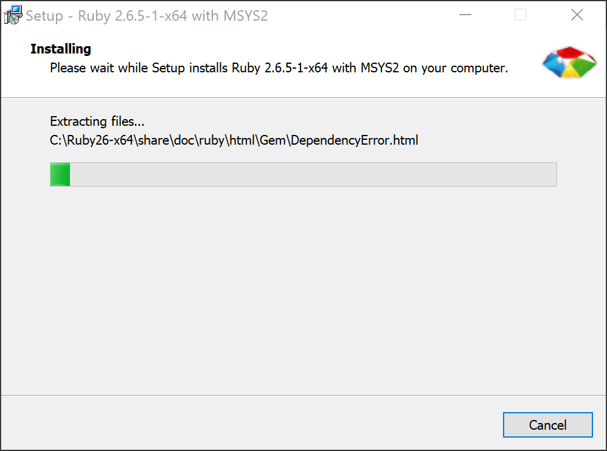

## Installing Prerequisites (Windows)

Install Ruby

1. Download the RubyInstaller from https://rubyinstaller.org/downloads/. Use the bolded version in the "WITH DEVKIT" section.

    

2. Run the installer
3. Accept the licence agreement and click Next

    

4. Make sure "Add Ruby executables to your PATH" is checked and click Install

    

5. Make sure "MSYS2 development toolchain" is checked and click Next

    

6. Wait for the installer to finish

    

7. Make sure "Run 'ridk install' to setup MSYS2 and development toolchain" is checked and click Finish
    
    

8. A new window should pop up that looks like this. Hit the Enter key to continue.

    

9. After a while you should get a message that says "Install MSYS2 and MINGW development toolchain succeeded". Hit the Enter key to close the window

    

Install Bundler

1. Open a new command prompt
2. Run `gem install bundler`

## Setup

1. Clone the repo
   - `git clone git@github.com:Tschrock/bedrock-addon-docs.git`
   - `cd bedrock-addon-docs`
2. Install project dependencies
   - `bundle install`
3. Start the development server
   - `bundle exec jekyll serve`